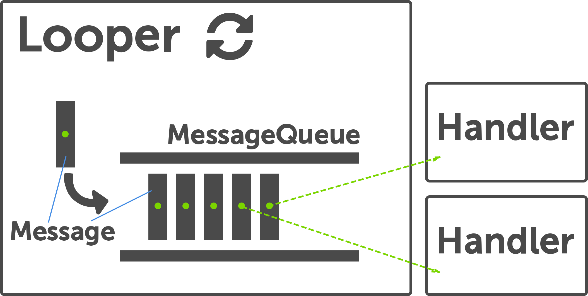

Last week I finished a substantial rewrite of the concurrency portions in the code of a fairly
complex embedded system we currently develop at work. It has been quite a roller-coaster ride and I
went back and forth between moments of joy and situations where I would tear my hair out. In the end
I'm quite happy with the result and want to reflect about some of the things I learned.  
Our target platform is very restricted concerning memory footprint and CPU and we have only a very
basic operating system. Thankfully we can use C++ (with some restrictions) so it's a rather pleasant
development platform. The OS has support for [preemptive scheduling] of computational execution
units similar to threads that all share the same address space. To simplify the discussion I will
refer to them simply as *threads*. Those threads are created at startup only and are assigned static
priorities that only change briefly when [priority ceiling] kicks in to avoid [priority inversion]
style problems. Most of the threads are not allowed to block as they need to guarantee some realtime
behavior. Other threads run with a lower priority and might execute some blocking and potentially
long-running IO function (e.g. write to persistent memory).  

## <i class="icon-thread"></i> Thread Communication

### Using Shared Memory

### Shared Memory

------------------------------- ----------------------------------
<i class="icon-plus-sign"></i>  easy to get something going quickly
<i class="icon-plus-sign"></i>  performance
<i class="icon-plus-sign"></i>  concurrency primitives are usually made available by the OS
<i class="icon-minus-sign"></i> prone to deadlocks
<i class="icon-minus-sign"></i> potentially lots of [critical sections]
------------------------------- ----------------------------------

Threads can communicate using shared memory. But that needs some form of synchronization to avoid
[race conditions]. Every access to a shared mutable chunk of data needs to be protected to enforce
the correct sequence of writes and reads. This can be achieved using some form of lock mechanism but
is a notoriously tricky task to get right. You might end up with data races or deadlocks.  
An effective technique to minimize the regions of code that need protection is to try to move all
code execution that needs to use shared memory onto the same thread of execution. That way a lot of
the API calls might not need to offer a thread-safe interface &rarr; less chance to mess things up
(miss)using locks. One way to achieve this is to post an executable code unit to another thread
([delegates] are especially well suited). That's the kind of approach Android follows with
[AsyncTasks]. The motivation here is that the UI must not be manipulated from any other context but
the UI thread.

The approach we took so far is just that: try to reduce the critical sections to a minimum by
pushing delegates around and executing them in other threads. We also implemented our own version of
futures (unfortunately our [stupid compiler] does not feel the need to support C++11 features yet)
which is a huge help to avoid the asynchronous *callback-hell*. But futures have a noted problem:
they introduce blocking into the system which is highly undesirable!

### Communicating with Messages

Using messages to invoke a certain behavior might sound unfamiliar to most object oriented
programmers today but is actually one of the original concepts behind object orientation. Java or
C++ hide the messaging idea behind the scenes, smalltalk makes no fuss about it: you use messages to
communicate. But those forms of communication are synchronous, i.e. the caller blocks until the
receiver has finished executing code.  
In smalltalk sending messages has the form of `[object] [message]`. Here is a small example from
smalltalk where we send the message factorial to 42:

~~~ {.cpp}
42 factorial
~~~

For making use of message passing in a concurrent environment, it needs to be asynchronous (&rarr;
non-blocking). The caller sends a message and is done. If some information needs to be transfered
back to the caller, this has to happen in another message. To be able to work on messages, the
caller needs to maintain a message-queue. Messages from a caller will be enqueued and processed on
the receiver thread.  
Message-queues are traditionally a tool for synchronizing access to shared resources. To hand of
work to another thread, some form of executable units can be added to the queue by multiple caller
threads. A worker-thread picks up those units sequentially and executes them. The only thing that
needs to be synchronized here is the access to the message-queue. Here is the general idea:

~~~ {.cpp}
// caller-thread
messageQueue.add(workItem)

// worker-thread
while(!done)
  workItem = q.pop() //will block until work is available
  workItem() //execute the code
~~~

This model is famously used by Erlang and even has the potential to be used for distributed systems
since the communication threads/processes do not need to share the same address space. All the
locking is happening under the hood (the message queue takes care of this) so the programmer
does not need to worry about it.

## Message Passing in Android

Android has picked up on this idea and makes use of it in form of the [looper framework] which you
can find in multiple places inside the Android source code. This framework is a very handsome form
of the [active object pattern] that is primarily used to enforce a non-blocking and responsive
UI-thread. It is mainly implemented in the classes **Looper**, **Handler** and **MessageQueue**.  

### Active Object

For those who are familiar with the active object pattern, here is an overview of how the concepts
match to the Android Looper framework:

* *Looper* corresponds to the *Scheduler*
* *Handler* to the *Servant*
* *MessageQueue* to the *ActivationList*

For me the most natural way to grasp those concepts was to associate the motivation for this
framework with the implementation details: we are running on a client thread and want to have code
executed in another thread context.  
A queue is a perfect match since we can enqueue our request (= message) that
will later be serviced. So we got the **MessageQueue**.  
Now we need someone who picks up our message in the worker thread and schedules the processing of
it. That's the job of the **Looper**.  
Once the Looper has popped of a message of the message-queue, it needs to know *who* should process that message: and here we get to the
**Handler**.  
There is no need for explicit locking, synchronization happens implicitly inside the message-queue.

  

## Message Passing in C++

The Android looper framework is all java code which I cannot use. But fortunately [a colleague] took
the time to do an efficient [C++ port] which is easily portable for multiple platforms. This was just the
right starting point for our project and we could reuse the code with only some minor modifications
(mostly to sacrifice functionality for a even more reduced memory footprint).  
Each incoming message features a reference to the handler who is needed to perform a service.
The looper code shows what's going on. Here is the main workhorse-function that drives the whole
asynchronous message processing:

~~~ {.cpp}
// static function
void Looper::loop()
{
    Looper* me = myLooper();//looper for current thread
    if (me)
    {
        MessageQueue& mq = me->mMessageQueue;
        while (true)
        {
            Message& message = mq.dequeueMessage();
            Handler* handler = message.mHandler;
            if (!handler)
            {
                return;
            }
            Message cloneMessage(message);
            cloneMessage.mHandler = NULL;
            message.recycle();
            handler->dispatchMessage(cloneMessage);
        }
    }
}
~~~

### Condition Variable

Sometimes threads need to wait for some condition to become true. A condition-variable is a
synchronization primitive that can be used for that purpose: block until some other thread signals
or a timeout occurs. To use the wait function, the thread first needs to acquire a lock. This lock
will be released by the condition-variable as long as the thread is halted. Once the
condition-variable notifies and the thread continues, the lock is re-acquired.

Since a looper is specific to the thread it is running on, the *loop* function can be static and figures
out which looper is running in the current thread (*myLooper*). Quite similar to the message queue
pseudo code sample from above, the looper loops through the message queue to schedule the next
request. For each dequeued message, it reaches for the handler associated with it to
process the message. Since each message knows about it's handler, it's quite natural to have
multiple handlers that each are responsible for different services.

The message queue itself works on a linked list of messages. Most of the times the queue itself is
implemented as a priority queue or a simple FIFO. It's main functions are enqueue and dequeue.  
An enqueue is triggered through client code, the dequeue happens on the looper (worker) thread and
might even block when there is nothing left in the queue. A condition variable is used for
synchronization. In case the message-queue in a looper is empty it will block on a dequeue by using
a condition variable to *wait*. The calling thread will trigger a *notify* for the condition
variable and will get the blocked thread and the looper inside going again.

~~~ {.cpp}

bool MessageQueue::enqueueMessage(Message& message, uint64_t execTimestamp)
{
    // check if the message is valid and we are not quitting
    ...
    // insert message into linked list according to timestamp
    ...
    mCondVar.notify();
    return true;
}

Message* MessageQueue::dequeueMessage(Message& message)
{
    while (true)
    {
        // RAII style locking
        AutoLock autoLock(mCondVarLock);
        if (mQuiting)
        {
            return NULL;
        }

        uint64_t now = Clock::monotonicTime();
        // getNextMessage returns next due message or NULL if nothing is due
        if (getNextMessage(now, message) != NULL)
        {
            return &message;
        }

        if (mHeadMessage != NULL)
        {
            // there are messges in the queue
            if (mHeadMessage->mExecTimestamp - now > 0)
            {
                // wait until next message is due
                ...
                mCondVar.wait(absExecTimestamp);
            }
        }
        else // no messages available, just wait until notified
        {
            mCondVar.wait();
        }
    }
}

~~~

For the client, sending a message instead of calling a blocking function requires some fundamental
changes in the the way the code is structured. Functionality is no longer specified by abstract base
classes and virtual functions but through a set of predefined integral values that are used to type
messages. Those message-ids (or event-ids) are needed so that the Handler can dispatch on them
and invoke the required functionality.  For the result the caller will only be notified in an
asynchronous fashion (if needed at all).  
A client that wants to send a message first needs to *obtain* a message from the receiving Handler.

~~~ {.cpp}
class Handler
{
public:
    ...

    Message* obtainMessage(Message& message, const int32_t what)
    {
        return Message::obtain(message, *this, what);
    }
    ...
    virtual void handleMessage(const Message& message);
    ...
    bool sendMessage(Message& message);
    bool sendMessageDelayed(Message& message, uint32_t delay);
    bool removeMessages(int32_t what);
    ...
};

~~~

For obtaining a message from a handler we need to pass in another message object which is a nice way
to enforce the responsibility of the resource management for messages on the caller side. Here a
message will receive the reference to it's handler. This message can then be sent (*sendMessage*)
which triggers the whole looper mechanism and asynchronously ends up in the *handleMessage* function
of the handler.  This *handleMessage* function will finally dispatch on the message-id which got
it's value from the *what* argument in *obtainMessage*.

~~~ {.cpp}

class SomeHandler : public Handler
{
public:

    virtual void handleMessage(const Message& msg)
    {
        switch (msg.what)
        {
        case EVENT_ID_A:
            // do your stuff
            break;
        ...
        }
    }
    ...
};

~~~

Notice that the message passing approach also allows to send messages to ourselves. That way we get
a timeout mechanism for free by sending messages with a delay.

## Programming in Message Passing Style

As already pointed out, the interaction patterns of code using asynchronous message passing instead
of conventional function calls are drastically different. There are no direct return values and code
that used to make one function call after another has to be factored into multiple functions that in
turn get called with the results.

  

And even more, it's no longer possible to use stack allocated variables as arguments to the function
call since there won't be any stack after our function ends.  One way around that is to use heap
allocated structs that pack the information for the function call together and attach those to the
message. Here is an example of a formerly synchronous call where the execution get's moved to a
background thread. The synchronous version looks like this:

~~~ {.cpp}
void client::myFunction()
{
    bool res = encrypt(
                  buffer,
                  bufferLength,
                  MAX_LEN_RESULT,
                  encrypted,
                  encryptedLength);
    if (res)
    {
        ...
    }
    ...
}
~~~

Using a struct to transport all the parameter information looks like this:

~~~ {.cpp}
// parameter pack
struct encrypt_call
{
    ...
    // constructor etc.

    uint8* data2encrypt;
    uint16 dataLength;
    uint16 maxEncryptedLength;
    uint8* encryptedData;
    uint16* encryptedDataLength;
    bool success;
};

// usage

void client::myFunction()
{
    ...
    encrypt_call* ec = new encrypt_call(
            buffer,
            bufferLength,
            MAX_LEN_RESULT,
            encrypted,
            encryptedLength);

    // obtain the response message
    this->obtainMessage(responseMessage, DATA_ENCRYPTION_FINISHED_EVENT);
    // attach context
    responseMessage.obj = (void*)ec;

    // obtain the actual message
    myService.obtainMessage(message2handler, ENCRYPT_DATA_EVENT);
    // attach response message
    message2handler.obj = (void*)&responseMessage;

    // send message will enqueue message in the handler's message queue
    myService.sendMessage(message2handler);
    ...
}
~~~

The trick here is to use two messages: one for the request and one for the response. That way we can
let the handler know who will process the response (remember, each message knows it's handler). So
we process the response ourselves and have to implement the *Handler* interface.

  

Since we are a *Handler*, we obtain a message from ourselves that we attach to the message we
obtain from the receiving handler (*myService*). When the *myService* object later handles our
message, it can use the attached message to fire the response.

~~~ {.cpp}
void service::handleMessage(const Message& eventMessage)
{
    switch (eventMessage.what)
    {
    ...
    case ENCRYPT_DATA_EVENT:
        {
            // get the response message
            Message* m = static_cast<Message*>(eventMessage.obj);
            // grab the context from the response message
            encrypt_call* ec = static_cast<encrypt_call*>(m->obj);
            // execute synchronous call
            ec->success = encryptData(
                              ec->data2encrypt,
                              ec->dataLength,
                              ec->maxEncryptedLength,
                              ec->encryptedData,
                              ec->encryptedDataLength);
            m->sendToTarget(); // send response back
        }
        break;
    ...
    default:
        break;
    }
}
~~~

In the worker thread we can finally get all the context for the synchronous call and send back a
message with the results so that our client can continue. Notice that there is no need for the
service code to clean up anything since the client can take care of cleaning up itself.

~~~ {.cpp}
void client::handleMessage(const Message& eventMessage)
{
    switch (eventMessage.what)
    {
    case DATA_ENCRYPTION_FINISHED_EVENT:
        {
            encrypt_call* ec = static_cast<encrypt_call*>(eventMessage.obj);
            if (!ec || !ec->success)
            {
                delete ec;
                printf("encryption failed\n");
            }
            else
            {
                delete ec;
                // continue processing
                ...
            }
        }
        break;
    default:
        break;
    }
}
~~~

Once our client handler receives the response message, it can query the result and clean up the heap
allocated objects.

## Welcome to Async Jungle

On first sight this asynchronous way of calling functions adds a lot of overhead and complexity.
Checking results on blocking function calls is no more... for every call we have to switch context
and loose our stack. And debugging your multi-threaded application is not getting easier: wanna take
a look at your call stack? Well your out of luck, the stack no longer provides a view into the past.  
But there are big gains as well. Most important: no need for explicit locking and a non blocking,
responsive codebase which can be vital e.g. if you are running in the UI thread! Once the code is
restructured it actually feels nice and tidy again. And in the lack of a full-blown stack for
debugging purposes can be mitigated somewhat by adding logging facilities in your message queues.  
And another very useful side-effect (especially for memory constraint systems) is that the stack sizes
actually do not grow as much which allows for a reduced memory footprint.

## The Good, the Bad and the Ugly

To completely become aware of the ramifications of the changes introduced for applying the message
passing paradigm it will probably take some time getting used to it and gaining experience. So far
our impression is throughout positive. Resource consumption actually went down while all the
explicit locking has disappeared. The code looks *very* different but that's not necessarily a bad
thing. All in all I'm quite happy with our new concurrency architecture. Thanks to [Daniel] for
bringing this approach to my attention and providing such a nice native implementation.

[critical sections]:http://en.wikipedia.org/wiki/Critical_section
[preemptive scheduling]:http://en.wikipedia.org/wiki/Preemption_(computing)
[priority ceiling]:http://en.wikipedia.org/wiki/Priority_ceiling_protocol
[priority inversion]:http://en.wikipedia.org/wiki/Priority_inversion
[race conditions]:http://en.wikipedia.org/wiki/Race_condition
[delegates]:/posts/2014-01-12-C++-delegates-on-steroids.html
[AsyncTasks]:http://developer.android.com/reference/android/os/AsyncTask.html
[stupid compiler]:http://www.windriver.com/products/development_suite/wind_river_compiler/
[looper framework]:http://developer.android.com/reference/android/os/package-summary.html
[active object pattern]:http://en.wikipedia.org/wiki/Active_object
[a colleague]:http://himmele.blogspot.de/
[Daniel]:http://himmele.blogspot.de/
[C++ port]:https://github.com/Himmele/Mindroid.ecpp
