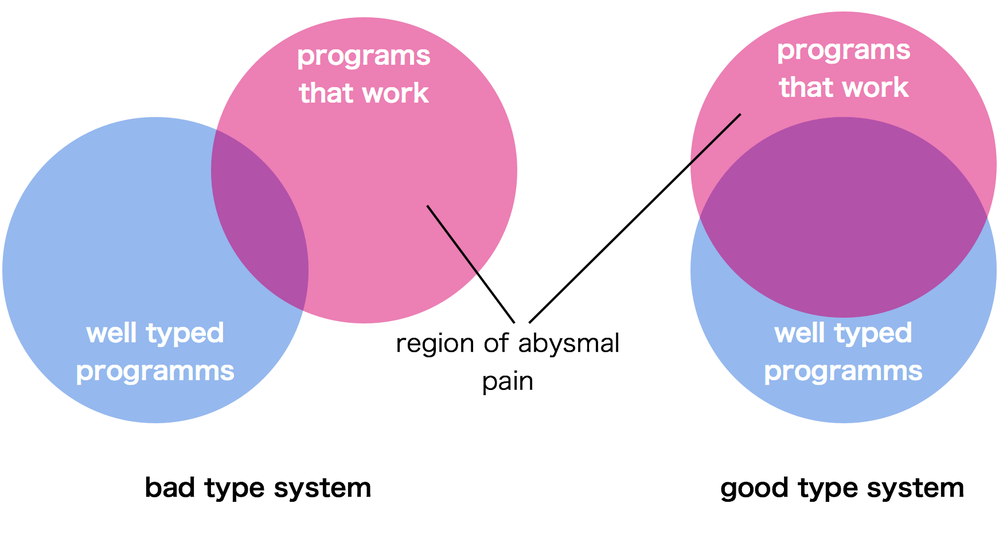
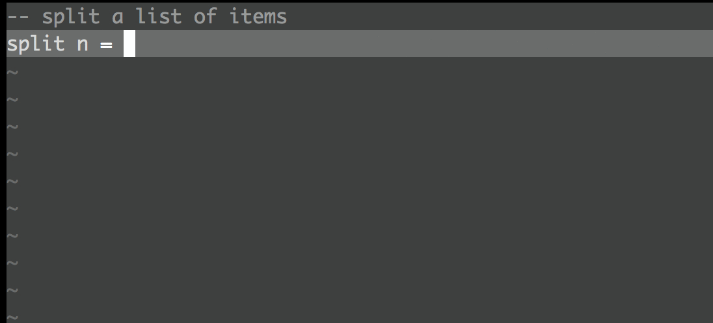
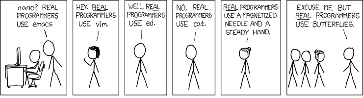
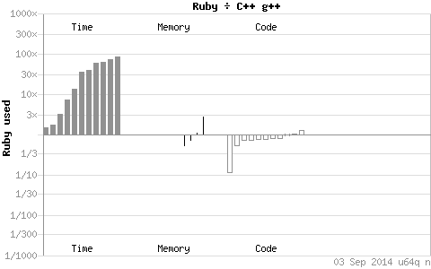

In my years as a developer I have used a lot of different programming languages. Most of them I
already tried to ban from my brain again (LISP still seems to give me nightmares from time to
    time -- [**L**ost **I**na **S**eaof **P**arentheses]). At the moment my most frequently used languages
include haskell, C++, Ruby and Lua: I immersed myself in C++ and it's intricacies. I got to really
love Ruby and it's ecosystem. Almost choked on haskell before I could swallow it and make it my
default turn-to language. And I was blown away by Lua's simplicity and range of application.  
Now whenever I start any programming-project, I almost certainly use one of those 4 languages. But
which one? In contrast to a lot of programmers I know I think that static and dynamic typed
languages both have very useful properties. And depending on the kind of project you are doing, one
kind might be more advantageous.

In this post I'd like to explore how the type of the type-system can influences to the choice of a
programming language for a new project. First let's look at some of the properties of static and
dynamic type systems. Later I explain what my personal reasoning behind selecting a language and
how it's type-system relates to that.

## Why care about Types

### Dynamic and Static Typing

This is my understanding of the kinds of typing: in statically typed languages a compiler checks the
types at compile-time, like in C++, Java and Haskell. In dynamically typed languages there are no
such checks, everything is checked at run-time. Examples include Ruby, Lua and Erlang.

Proponents of static typing argue that each error caught by the compiler is an error less to
debug/test for. The idea is that a type-checker analyzes the program at compile-time and rejects
everything that is wrong while admitting the correct stuff. That of course makes an intriguing
argument. Type safety is an desirable feature after all. But how does this play out in reality?  
One of my favorite examples of how the information that is available at compile time is actually not
used is C's unsafe *printf* function. If *printf* were type-safe, the following subtle bug just could
never happen:

~~~ {.cpp}
bool try2crash = ...;
printf("will this crash? %s", try2crash);
~~~

Instead of:

~~~ {.cpp}
printf("will this crash? %s", try2crash ? "true" : "false");
~~~

In the first *printf* statement the programmer forgot to convert the `bool` to a string. *printf*
assumes the address of a null-terminated string. In case we pass in `0`, there is a special
treatment so *printf* will output `(null)`.  That means everything goes fine as long as `try2crash` is
false (which is 0 in C).  But when it is `true` (==1 in C) we get undefined behavior and might
crash.  
Using [`<iostream>`] in C++ would have prevented this bug entirely.  
Ok, but then we have another problem that often gets associated with static typing: the code tends
to get bloated and harder to write. Andrei Alexandrescu provides a nice example in his [Type-Safe
Formatting] paper. A seemingly innocuous *printf* statement takes some getting used to when
translated to iostreams:

~~~ {.cpp}
printf("Hi, count=%s, time=%s, radius=%-6.2f!", count, theTime, radius);
~~~

And this is the same thing in iostreams–based code:

~~~ {.cpp}
const int savePrec = std::cout.precision();
const int saveWidth = std::cout.width();
const std::ios_base::fmtflags saveFlags = std::cout.flags();
std::cout << "Hi, count=" << count
          << ", time=" << theTime << ", radius="
          << std::left << std::setw(6)
          << std::setprecision(2)
          << std::fixed << radius << "!"
          << std::endl;
// restore formatting state:
std::cout << std::setprecision(savePrec)
          << std::setw(saveWidth);
std::cout.flags(saveFlags);
~~~

As always Andrei has his unique sense of humor and comments:

> If iostreams are a step towards the future, I sure hope the future will have a definitive solution
> for the Carpal Tunnel Syndrome.

### Getting in your way

Sometimes the type-system really seems to put more obstacles in your way. Using C++ on a daily basis
there definitely are some mis-features that I'd blame the types-system for. Here is one of the
example that is quite annoying (at least to those stuck with C++98):

~~~ {.cpp}
std::map<string,int>* m = new std::map<string,int>();
for (std::map<string,int>::const_iterator iter = m->begin();
         iter != m->end(); ++iter)
{
    ...
}
~~~

Why should I repeat myself in the definition of m? And why do I have to tell the compiler the type
of the iterator when there is only one possibility? Fortunately things already got better with C++11:

~~~ {.cpp}
auto m = new map<string, int>;
for (auto iter = m->cbegin(); iter != m.cend(); ++iter)
{
    ...
}
~~~

Or even better using a range for loop:

~~~ {.cpp}
for (const auto& x: *m)
{
    ...
}
~~~

Still, to a Ruby or Python programmer having to spell out the type *explicitly* feels like a sever
obstacle. But there is no way around in languages like Java and C++.  
It might sound that I feel there is too much baggage coming with a static type system, but that is
not at all the case. Some statically typed languages for sure come with an overhead, but I think
this is almost completely related to an inferior type-system.  
Prime examples of static type-systems that just rock can be found in [haskell] and [Scala]. In those
languages the type system is specifically designed NOT to get into your way. Simon Peyton Jones --
the lead developer of the Glasgow Haskell Compiler ghc -- [talks about] what an ideal type system
should look like: There will always be well typed programs that don't actually work -- but what
really sucks are the programs a type checker refuses despite the fact that they are perfectly ok. A
good type system therefore needs to increase the overlap of those areas.

  

Take type inference for example: you can write most of your haskell code without adding any type
signatures -- the compiler *implicitly* can figure out the correct types. And if you feel like
adding them, just ask the compiler for it and have your [editor insert it on demand]. Type inference
has been around for a long time ([e.g. in ML]) and recently has gained in popularity in languages
such as Scala, Rust and Apple's [Swift]. It also allows for a very exploratory style of development
inside a REPL. An approach that has worked well for me: First get the functionality, then gradually
add the type signatures to tie down your invariants.  
Here is an example of a function that splits a list into chunks. Notice that we need no type
declaration whatsoever. The compiler can infere the type from the implementation.

~~~ {.haskell}
split n = loop
where loop [] = []
      loop xs
        | length xs >= n = (take n xs):loop (drop n xs)
        | otherwise = [xs]
~~~

And this is type inference in action.

  

### What a Type can tell you

Users of statically typed languages often use the type signature to convey the intention of a
function. The clients of the function gain some insight about the behavior of the code they are using.
That way even an undocumented function still reveals some crucial information and -- even better --
now has some compiler checked piece of documentation that will never be outdated.  
What does this mean? Take a look at the type of a certain haskell function:

~~~ {.haskell}
foo :: (a -> b) -> [a] -> [b]
~~~

This is a type signature of a function in haskell. The `a` and the `b` in the signature are
placeholders for any possible type, which is called *parametric polymorphism*. `a` could refere to an
Int, a String or any other type. `b` is indepent and also can take all possible types.  
The type signature of this ominous function tells us that the first parameter to `foo` is a function
itself (`(a -> b)`) that consumes input values of type *a* and produces a result of type *b*. The
second parameter is a list of values of type *a*: `[a]`, and the result type is a list of
values of type *b*: `[b]`. I think from this type alone it somewhat seems obvious that we have
kind of a mapping function like Ruby's `each` function, indeed it is haskell's `map` function.
Nobody really needs to read the documentation anymore:  
*"map f xs is the list obtained by applying f to each element of xs"*

The type of a function is in fact such a powerful piece of documentation that you can even use it to
search for other functions that you might wanna use: just [*hoogle*] for it! Let's say I have a
lexicographical order and I want only those names that start with a vowel. To check this condition,
I want to use a function that takes one of my names as an argument and returns a boolean: `name -> Bool`. And I want
to use this function on a list of names `[name]`. And the result should be a list of names again
`[name]`. So the searching in hoogle could be something like:

<pre class="terminal">
tmp > hoogle "(a -> Bool) -> [a] -> [a]"
Prelude dropWhile :: (a -> Bool) -> [a] -> [a]
Prelude filter :: (a -> Bool) -> [a] -> [a]
Prelude takeWhile :: (a -> Bool) -> [a] -> [a]
...
</pre>

`takeWhile` looks like that's the one to use.

### Get safer with Types

Independent what kind of typed language you program in, the application of types instead of
primitive values can prevent a lot of ambiguities. In a language with a type-checker you will even
discover any possible misuse at compile time. As an example, here is a function I recently wrote in
C++:

~~~ {.cpp}
bool schedule(uint32_t seconds){...}
~~~

It's not hard to see why this kind of function signature might get you into trouble down the road.
Of course it didn't take long before some user needed a better accuracy. So I changed the signature:

~~~ {.cpp}
bool schedule(uint64_t ms){...}
~~~

No compile-time or run-time check will save you from harm at this point. Using primitive types to
hide the semantics of your actual data will leave no clue about the real type hiding behind the
value. Same thing is true for strings: as nice it can be to encode some values in strings, using
them as the type of your parameters they won't reveal any useful information about the actual
structure of the value hiding inside.  
Here is the version I wish I had written from the beginning:

~~~ {.cpp}
class duration {
  private:
    duration(uint64_t _ms)
        : ms(_ms) {
    }
    uint64_t ms;
  public:
    static duration fromMs(uint64_t ms) {
        return duration(ms);
    }
    static duration fromS(uint32_t s) {
        return duration(1000*s);
    }
    uint64_t inMs() const {
        return ms;
    }
    bool operator==(const duration& rhs) const
    ...
};

bool schedule(duration d){...}
~~~

### Typing for the Lazy

As convenient as modern statically typed languages might allow you to integrate types into your
application, using a dynamic language like Ruby will always be quicker for a lot of coding tasks. It
frequently happens that I write a chunk of Ruby code, run it -- expecting it to crash on some type
mismatch -- only to find that it works just fine! It's exactly this very hard to tie down property
of dynamic languages like Ruby that makes them such a productivity boost. Programming like this
might sometimes be kind of careless --- but it often is quite carefree as well.  
Languages like Ruby or Python might not be statically typed, but they still have a strong
type-system. Since they are interpreted instead of compiled, an easy check by a compiler is not
possible. The types are checked at runtime and will fail in a rather graceful manner (much better
then the runtime crashes you get in C++). However, gaining a similar level of confidence is still
feasible --- by writing the right kind of unit tests that exercise the code so that type mismatches
are caught nevertheless.  
But here you cannot be lazy and really have to write the tests! Which I find amazingly hard! Writing
good and maintainable unit tests is difficult and takes some thinking. Bad unit tests will come
haunt you at the latest when you want to refactor your code. Having said this, the nature of dynamic
languages like Ruby makes writing tests a *lot* easier! You don't have to invent interfaces to stub
out functions or introduce mock objects. Just use any object that is convenient for your test,
stick the method you need to it -- and duck-typing will take care of the rest.

Another amenity often attributed to dynamic languages is conciseness. While it's definitely not true
that statically typed languages imply verbosity -- haskell is a wonderful counter example -- there are
some that are virtually unmanageable without the support of a good IDE (like Java). And while the
task of writing the code can somewhat be eased by IDEs, the task of reading code is not!

> Working with languages such as Java and C# I always feel the need to skip over text in order to
> understand what's going on. [^1]

[^1]: [Martin Fowler on dynamic typing] 

Keeping your code-base tight and clean will leave it more readable and transparent. People will have
a much easier time finding bugs or just changing things around.

## Deciding on the Types

Choosing a programming language and -- with it -- the nature of the type-system will have
consequences in different areas: the development ecosystem, the build process, the testing strategy
and much more.

### Saddle up for a new project

Starting out with a new project you obviously have to make a decision on the programming environment
you'd like to use. When I do a project just for myself I don't want to waste any time with setup
stuff so the initial effort has to be as painless as possible. And getting started in a Ruby
environment seems to be the quickest way to me.  
Getting everything ready for a haskell project seems similarly simple but does suffer a little speed
bump when you compile a lot of the dependencies in a sandbox.  
All this setup stuff might seem negligible but I found it can be a major stumbling block that can
prevent you from starting a project at all. So I'm really a fan of a lean setup! The quicker the
setup, the more likely it is to start in the first place.  
It's arguably also very fast to setup a Java project. That is, if you use an IDE -- which not
everyone does! But have you ever tried to setup an Android project *without* eclipse or intellij?
That's not what I'd call light-weight!

  

### Go with the Flow

Once your environment lets you to write and run some code, the most important factor for me is
having fun with it! Getting stuff done is fun. Writing an elegant piece of code is fun. Changing
things on the fly and see them working again is fun!  
What is not so much fun is when you [get bogged down by some obscure compiler error]! It's also not
fun when you would rather change some of your code but do not dare to on the risk of breaking your
program.  
In general I'd consider everything that impedes the flow of the programming experience as a bad
thing. In light of these observations, which type of programming language solves the majority of
the problems while remaining fun to use?

### The Kind of Project

In many cases the decision to use a statically or dynamically typed language on a project is not an
open choice anyway. If you only have a C-compiler for your embedded target, your choices are kind of
limited. In other situations there might be a non-functional requirement imposed by your client.  
But let's suppose we are free to choose whatever we like. For these cases I have my own checklist ---
which of course is highly subjective and heavily influenced by my own development background.

**Working alone or on a team?**

When I'm working alone, the choice of static or dynamic is not important. However, it's different
when working on a team. Communication is crucial and a language with a static type system can help,
especially if the type system is very expressive. The intended usage of a function becomes more
obvious to me when I see what types the function is supposed to work on. And using functions in an
unintended way just becomes less likely. So in general I'd choose to go with a statically typed
language.  
Having said this it's obviously true that there are a lot of huge rails developments going on
that just work fine. So the dynamic nature of the type of a language certainly does not prevent such
projects -- you just have to do some stuff manually that a good type checker could take care of: put
tighter control on the interfaces between different components in your system (e.g. plugin systems),
make sure you have regression tests that exercise the constraints you'd like the system to obey to,
use commonly understood conventions a.s.o.

**Writing a script like application?**
There is not really a decision to make here -- it's just ideal to use a dynamic language. In fact
for quite some time now I have written all of my shell-scripts and [build-scripts] in Ruby. The OS
abstraction for everything you'd need is decent, string processing is a bliss and combining that
with some a sensible internal DSL[^2] just makes your scripts fly.

[^2]:Domain Specific Language

**Working on a quick prototype?**
For this one it's almost a tie: dynamically typed of course, but especially haskell can really stick
out in this area, too. While I find it very convenient to solve real world problems in Ruby, haskell
seems to be a better fit when the problem at hand itself is not well understood. Systems can be
built in a very type-driven kind of style: first think about what kind of abstractions make sense
for your domain and what functions you'd need to operate on your data. In haskell you can leave out
the implementation and still typecheck your program. Then gradually start filling in the
implementations. [Tomas Petricek] has written a nice post about what he calls TFD --- Type First
Development.

**Working on a long living software?**
The picture is again much clearer when I plan to keep working on the project for a long time: I
wouldn't want to miss the comfort of a good type-checker when I come back after a year, change some
stuff and get smacked upside the head for all the places I forgot to adapt. You don't even need a
language with a clever type system. C++ and Java will do just fine.  
Again, achieving an equal level of confidence is possible with tests, but call me lazy -- I like
that the compiler takes care of some of the checks!

**Performance matters?**
It always does, doesn't it? Well, it really depends... Compiled languages tend to be faster since
the compiler can produce natively executable code for a specific processor. A dynamic language is
interpreted and all the translation step has to be done at runtime.

  

For most of the tasks at hand I found even Ruby will do the job in an adequate time frame. But
sometimes speed is really an issue, and this is when I value C++ the most. Haskell's performance
usually can almost match up, but tuning a C++ program for speed is still easier for me than
optimizing the haskell version.  
Lua surprisingly also does really well in this area. Especially when using [luajit], a Just-In-Time
Compiler for Lua. And for really performance critical functions Lua makes it [astonishingly easy] to
call out to a C implementation.

**Working on an embedded target?**
In my daily work I work a lot with really small embedded systems. That's something like 256 KB of
RAM and 2MB of flash memory and very limited processing power. For such a constraint system it's
kind of a natural choice to stick with a low level compiled language. And the one low level language
that will still give you some usable support on the type level is C++.  
But not all hope is lost! There is this tiny language: Lua! Which really is tiny! In one of our
systems we use it on such a controller in addition to the native code and it only needs s.th. like
20 KB of RAM and 64KB of flash memory. And for some applications it's really nice to have a way to
change some code without having to recompile, build and flash a binary.

**Need to get s.th. done quickly?**
Then the type-system really should not get in the way! So haskell would be a good fit since it's
possible to express a lot in a very concise way. Ruby seems to be even quicker. It's similarly
concise and makes the development cycle even shorter. And getting stuck on a problem is rare in Ruby
since there is an [abundance of tips], articles and tutorials on every topic I googled so far.

## Yours to choose

To me it's not a black and white kind of decision to make. Both statically and
dynamically typed languages have applications where they particularly shine. But it does make a huge
difference if you pick a language with a bad type-system or with a good one. I found that languages
with an inferior type system will cause all kinds of trouble and overhead. Using haskell or Scala a
lot of those troubles just don't exist anymore (e.g. type-inference is a huge step forward).  
In reality the end justifies the means. If the language of your choice does a decent job to help you
implement the requirements of the application, just use it.

[**L**ost **I**na **S**eaof **P**arentheses]:http://c2.com/cgi/wiki?LostInaSeaofParentheses
[Martin Fowler on dynamic typing]:http://martinfowler.com/bliki/DynamicTyping.html
[gemset]:https://rvm.io/workflow/projects
[bundler]:http://bundler.io/
[cabal]:http://www.haskell.org/cabal/
[`<iostream>`]:http://www.parashift.com/c++-faq-lite/iostream-vs-stdio.html
[Type-Safe Formatting]:http://erdani.com/publications/cuj-2005-08.pdf
[editor insert it on demand]:https://github.com/eagletmt/ghcmod-vim
[e.g. in ML]:http://gallium.inria.fr/~fpottier/publis/emlti-final.pdf
[Swift]:http://bit.ly/swift-type-inference
[haskell]:http://en.wikibooks.org/wiki/Haskell/Type_basics
[Scala]:http://www.scala-lang.org/
[talks about]:https://skillsmatter.com/skillscasts/3842-keynote-3842
[abundance of tips]:http://stackoverflow.com/questions/tagged/ruby
[get bogged down by some obscure compiler error]:http://www.reddit.com/r/cpp/comments/2dledw/i_just_produced_a_single_488k_boost_error_any/
[build-scripts]:http://marcmo.github.io/cxxproject/
[Tomas Petricek]:http://tomasp.net/blog/type-first-development.aspx/
[luajit]:http://luajit.org/
[astonishingly easy]:http://luajit.org/ext_ffi_tutorial.html
[*hoogle*]:http://www.haskell.org/hoogle/
